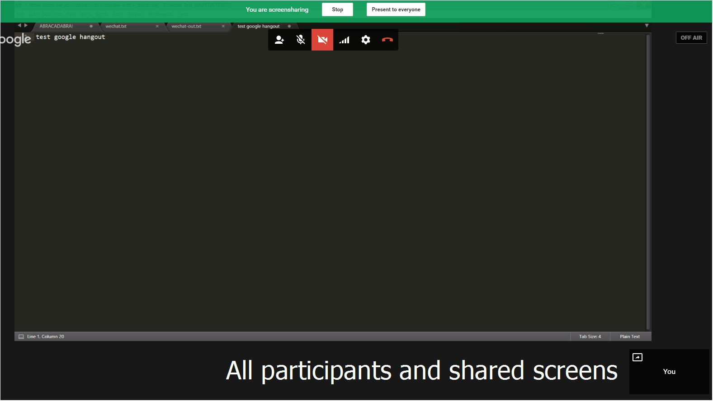
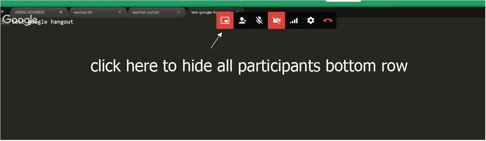

## Google Hangout Video Conference Recording Steps

Our hangout video conferences were recorded with google hangout on air and will be uploaded to the recorder's personal YouTube account. The video will be private and only posted in our private google plus community "Seattle Algorithm Discussion Group". The community is a private and unlisted thus cannot be searched.

1. Apply to upload videos longer than 15 minutes at [this link](https://support.google.com/youtube/answer/71673?hl=en).
2. Start or schedule Hangout on air (Note: must be on air) at [hangouts.google.com](https://hangouts.google.com/), **make sure to clear out the audience** and add yourself and our g+ community "Seattle Algorithm Discussion Group" in the audience.
3. Invite participants or share the link in our g+ hangout chat group.

### Tips and Traps

1. As a host and recorder, if someone is sharing his/her screen, it's better for you to present that shared screen to everyone and hide the bottom participants row.
2. You need to find that shared screen in the bottom row as shown in the screen shot below and select to present it to everyone.

3. Then you can click the leftmost button in the top menu bar to hide all participants bottom row shown in screen shot below.

4. Please to remember to switch to another shared screen if one speaker finishes and we switch to another speaker.